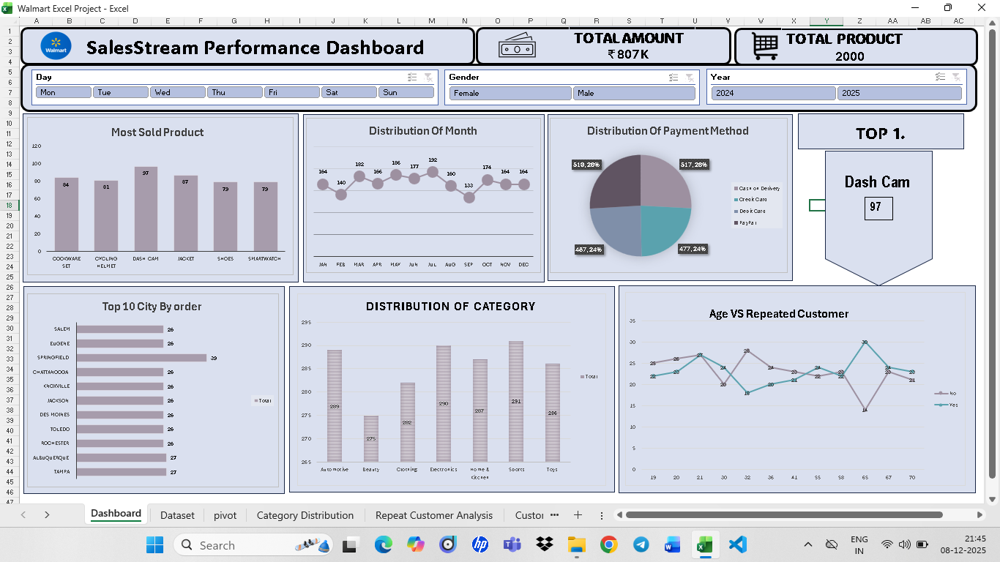

# 🛒 Walmart Customer Analysis – Excel Project

*Description:* Analyze Walmart customer data with dashboards and KPIs to understand sales, customer behavior, and product performance.

---

## *Project Objectives*
- Analyze customer data using Excel
- Build KPIs for sales and customer performance
- Create charts for customer distribution, category trends, and monthly activity
- Design an interactive dashboard with pivot tables and slicers

---

## *Key Questions*
- Total customers and revenue generated
- Repeat customers by age group
- Cities with highest customer engagement
- Most popular product categories and top-selling products
- Monthly customer activity trends
- Preferred payment methods

---

## *Dataset*
- Columns: Customer ID, Age, City, Product Category, Product Name, Purchase Date, Payment Method, Revenue

---

## *Process*
- Verified data for inconsistencies and missing values
- Ensured correct formats for dates, numeric fields, and categories
- Created pivot tables for customers, categories, cities, products, months, payments
- Built KPIs from pivot outputs (Total Revenue, Total Customers)
- Combined charts and KPIs into a single dashboard
- Added slicers for interactive filtering

---

## *Dashboard Screenshots*
- 

---

## *Charts & Insights*
- *Line Chart – Repeat Customer Analysis:* Age groups with higher repeat purchases
- *Bar Chart – Customer Distribution by City:* Shows cities with most customer activity
- *Bar Chart – Category Distribution:* Highlights preferred product categories
- *Bar Chart – Top Selling Products:* Shows products with highest customer count
- *Line Chart – Monthly Activity:* Trends in customer engagement per month
- *Pie Chart – Payment Method Analysis:* Shows most used payment methods

---

## *Conclusion*
- Provides a comprehensive view of customer behavior and sales trends
- Supports informed business and marketing decisions

---

## *Future Enhancements*
- Customer segmentation for deeper insights
- Revenue contribution by category/city
- Automated data refresh with Power Query
- Advanced Power BI dashboard version
- Comparative analysis for different time periods
